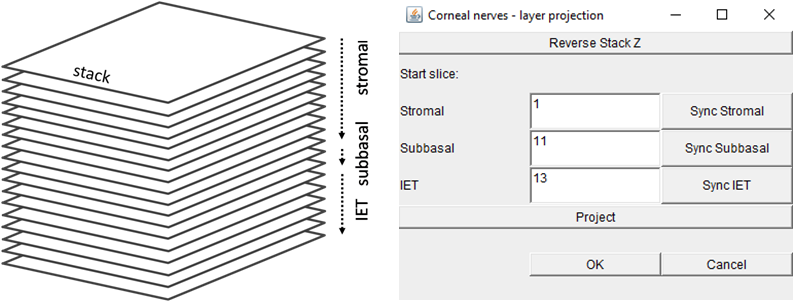
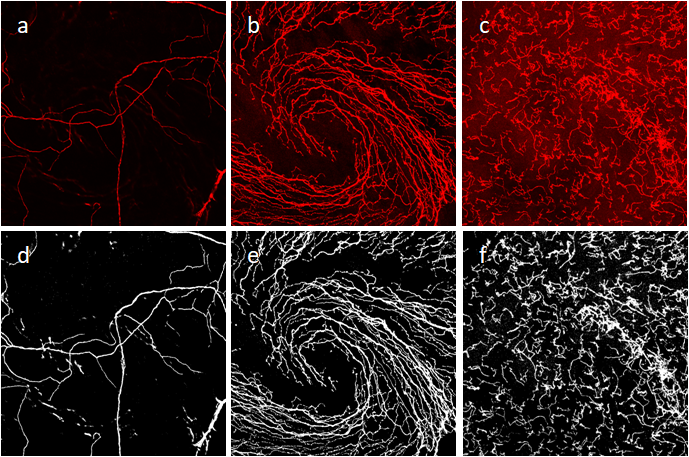
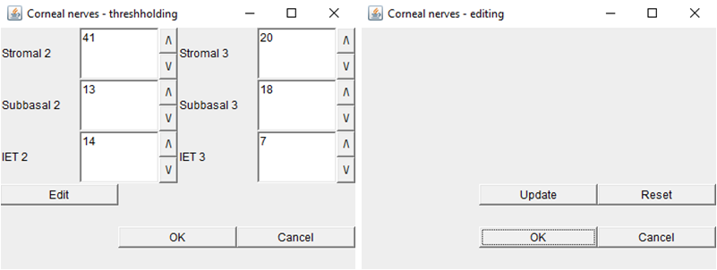
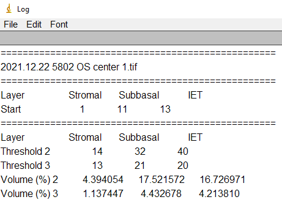

# ImageJ Plugin Corneal Nerves

Plugin Corneal Nerves automates the workflow of corneal nerve density analysis of stromal, subbasal and intraepithelial terminal (IET) layers imaged by confocal microscopy. 

On an image stack composed of the stromal, subbasal and IET layers, plugin Corneal Nerves first needs to know the start slice for each layer.  If the current slice while browsing stack is the start slice of a layer, the start slice of the layer in the window “Corneal nerves – layers projection” can be synchronized to the current slice using buttons ”Sync Stromal”, “Sync Subbasal” and “Sync IET”. The plugin does projection for each of the layers using button “Project”.

Plugin Corneal Nerves can handle the stromal, subbasal and IET layers imaged in channels 2 and 3. (a), (b) and (c) are the projected layer images of channel 2. The plugin auto-detects thresholds on the projected layer images, and generates the initial density analysis of the stromal, subbasal and IET layers. (d), (e) and (f) are the initial thresholded layer masks.

In the window “Corneal nerves – thresholding”, plugin Corneal Nerves allows to tweak the thresholds using buttons “/\” and “\\/” or by inputting thresholds followed by “Enter” key, and the density analysis updates correspondingly. Press button “Edit”, the window changes to “Corneal nerves – editing”, where the plugin allows to do manual editing on the thresholded layer masks, and update the density analysis using button “Update”. Button “Reset” resets all the layer masks to before starting the manual editing and the plugin goes back to the window “Corneal nerves – thresholding”. Once the analysis is good, press button “OK”. 

Here is an example result of corneal nerve density analysis by plugin Corneal Nerves:

